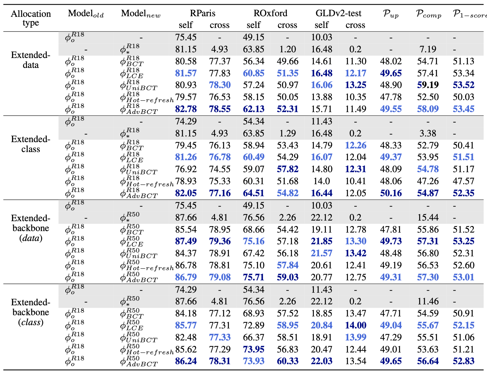

# Boundary-aware Backward-Compatible Representation via Adversarial Learning in Image Retrieval [PDF]
## Introduction
Backward-compatible training (BCT) aims to deploy a new model without the operation of "backfilling". We introduce AdvBCT, an Adversarial Backward-Compatible Training method with an elastic boundary constraint that takes both compatibility and discrimination into consideration. The codes for AdvBCT and the benchmark are all publicly available in this repo.
Thanks to the work [Hot-refresh](https://github.com/TencentARC/OpenCompatible). Some implementaions of our code are based on it.

Our paper has been accepted by CVPR2023.
## Datasets
refer to [Dataset.md](./data_loaders/Dataset.md).
## Enviroments
```bash
conda create -n bct python=3.7
conda activate bct
#conda config --add channels https://mirrors.tuna.tsinghua.edu.cn/anaconda/cloud/conda-forge/
conda install faiss-cpu
pip install -r requirements.txt
```

## Train
* run scripts/train_old.sh to train the old model. change configs/old_model.yml, MODEL.ARCH, TAG, and TRAIN.FILE_DIR to set different allocation types.
* run scripts/extract_feat.sh to get feature centers with the old model.
* run scripts/train_new.sh to train new models. change configs/new_*.yml to configure different allocation types.
## Evaluation
evaluate datasets on 32G v100

```bash
mkdir -p output/final_model
```
* move models to ./output/final_model/.
Models can be download in [GDrive](https://drive.google.com/drive/folders/1sjlvFiEJTF2Zkt-Tal1KH-Gce_Wra9EH?usp=share_link). The password is 9168.
* test. change model paths and arch to test your models.
```bash
bash scripts/test.sh landmark roxford5k ./data/ROxfordParis/
bash scripts/test.sh landmark rparis6k ./data/ROxfordParis/
bash scripts/test.sh landmark gldv2 ./data/GLDv2 # take a long time
```

####  Results


### Next-step
The following content will also be released soon.
- [x] Release of preprocess codes for training datasets.
- [x] Release of training codes for 5 works.
- [ ] Release of the trained models.

### License
The code is released under MIT license.
```plaintext
MIT License

Copyright (c) 2022 AdvBCT

Permission is hereby granted, free of charge, to any person obtaining a copy
of this software and associated documentation files (the "Software"), to deal
in the Software without restriction, including without limitation the rights
to use, copy, modify, merge, publish, distribute, sublicense, and/or sell
copies of the Software, and to permit persons to whom the Software is
furnished to do so, subject to the following conditions:

The above copyright notice and this permission notice shall be included in all
copies or substantial portions of the Software.

THE SOFTWARE IS PROVIDED "AS IS", WITHOUT WARRANTY OF ANY KIND, EXPRESS OR
IMPLIED, INCLUDING BUT NOT LIMITED TO THE WARRANTIES OF MERCHANTABILITY,
FITNESS FOR A PARTICULAR PURPOSE AND NONINFRINGEMENT. IN NO EVENT SHALL THE
AUTHORS OR COPYRIGHT HOLDERS BE LIABLE FOR ANY CLAIM, DAMAGES OR OTHER
LIABILITY, WHETHER IN AN ACTION OF CONTRACT, TORT OR OTHERWISE, ARISING FROM,
OUT OF OR IN CONNECTION WITH THE SOFTWARE OR THE USE OR OTHER DEALINGS IN THE
SOFTWARE.
```